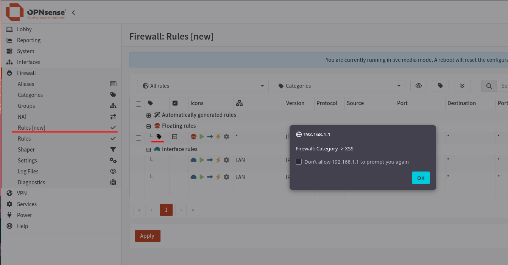
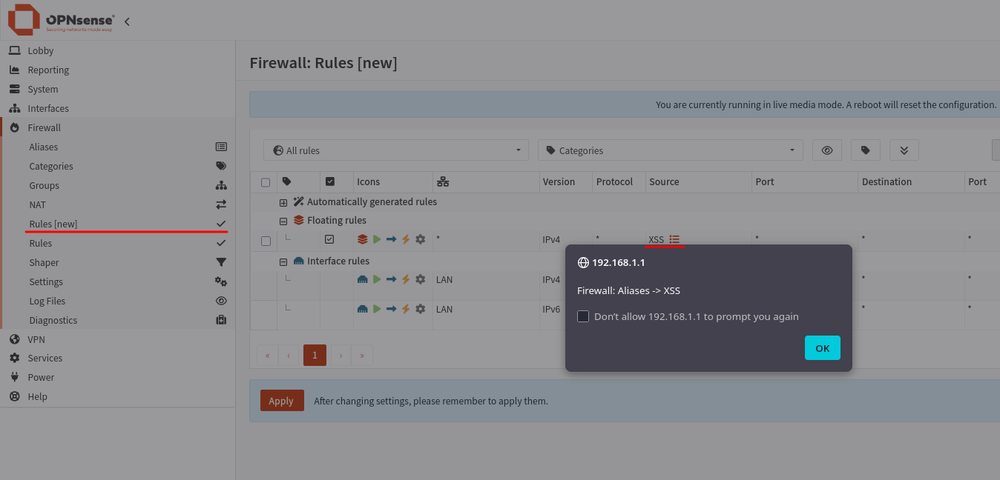

# Stored XSS in Firewall Rules/NAT pages via a HTML-attribute breakout

- Severity: Moderate (5.4) - `CVSS:3.1/AV:N/AC:L/PR:L/UI:R/S:C/C:L/I:L/A:N`
- Software: [OPNsense](https://github.com/OPNsense/core)
- Version: `<26.1.10`
- References:
- - `TBA`
- - [GHSA-2xrm-p255-p43h](https://github.com/opnsense/core/security/advisories/GHSA-2xrm-p255-p43h)
- - [Blog Post](https://hackerask.com/posts/opnsense/)

## Summary

The Firewall Rules and NAT pages build tooltips using the `title="${...}"` HTML attribute with attacker-controlled free-text via string concatenation.
Two such free-text fields, a Firewall Category name and a Firewall Alias description, allow double-quote characters, because used `htmlspecialchars` (which encodes `< > &`) function leaves `"` and `'` untouched.
The surviving double-quote closes the `title` attribute and injects an event handler onto the existing `<span>`, yielding a **stored XSS**.
A low-privileged user, who can edit a category or an alias is able to store cross-site scripting payloads that runs in the session of any user/administrator, opening the Firewall Rules or NAT pages.

| # | Field                 | Sink                                                                            |
|---|-----------------------|---------------------------------------------------------------------------------|
| A | Category **name**     | `filter_rule.volt:481` (`title="${name}"`), `nat_rule.volt:386` (`${cat.name}`) |
| B | Alias **description** | `filter_rule.volt:619-621` and `nat_rule.volt:448` (`title="${tooltipHtml}"`)   |

## Details

### Root Cause

All session-client API output is wrapped in `htmlspecialchars($json, ENT_NOQUOTES)`. `ENT_NOQUOTES` encodes `< > &` but **not** `"`/`'`.
The grid formatters place the field value inside an HTML **attribute** built by JS string concatenation:

```js
// filter_rule.volt line 480-481 (category) and the identical pattern at nat_rule.volt line 385-386
<span class="category-icon" data-toggle="tooltip" title="${name}">      // name = cat.name (NOT escaped)

// filter_rule.volt line 619-621 (alias) and the identical pattern at nat_rule.volt line 448
const tooltipHtml = aliasInfo.summary || aliasInfo.description || aliasInfo.value || "";
return `<span data-toggle="tooltip" data-html="true" title="${tooltipHtml}">${aliasInfo.value}&nbsp;</span> ...`;
```

The value arrives with `<`/`>` entity-encoded (so a new `<script>`/`` tag cannot be opened), but the surviving `"` lets the attacker close `title` and add an event handler to the existing `<span>`.

## Proof of Concept

Authenticated as a low-privileged firewall operator (`Firewall: Categories` or `Firewall: Alias: Edit`).
Both payloads below use `onanimationstart`, which requires zero interaction to being triggered.
The globally-loaded `highlight` keyframe is loaded, leading to the handler firing automatically, when the user opens the page.
The trailing `x="` keeps the surrounding markup well-formed so the row renders normally.

### (A) Category name - Firewall -> Categories -> +

Set the name to:

```
" onanimationstart="alert('Firewall: Category -> XSS')" style="animation:highlight 1s" x="
```

Assign the category to any filter/NAT rule, save, then open **Firewall -> Rules** (and **Firewall -> NAT**) -> the handler fires on render.



### (B) Alias description - Firewall -> Aliases -> +

Set the description to:

```
" onanimationstart="alert('Firewall: Aliases -> XSS')" style="animation:highlight 1s" x="
```

Reference the alias in a rules **Source** or **Destination**, save, then open **Firewall -> Rules** (and **NAT**) -> the alias tooltip span renders the handler and it fires on load.



## Impact

A low-privileged firewall operator (category or alias edit only) can store javascript that executes in the authenticated GUI session of any user/administrator who views the Rules or NAT pages.
That permits theft of the CSRF token and execution of authenticated actions as the victim.

## Credit

Jonas Ampferl at Hacking Cult GmbH <https://hackingcult.de/>

Blog Post with writeup and PoC: <https://hackerask.com/posts/opnsense/>
