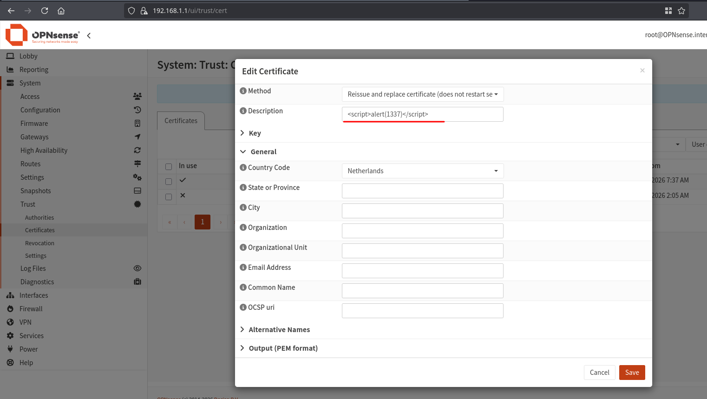
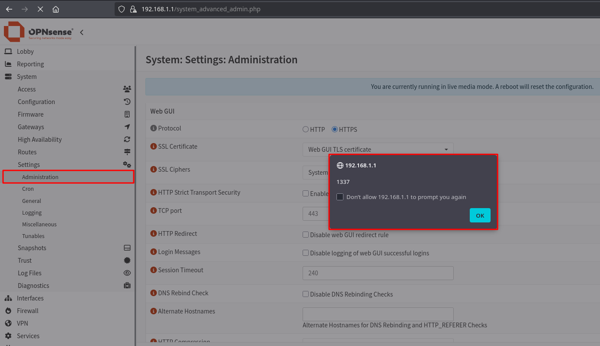

# Stored XSS in Administration Settings via Certificate Description

- Published: `TBA` (Reported: 25.06.2026)
- Severity: Moderate (5.2) - `CVSS:3.1/AV:N/AC:L/PR:H/UI:R/S:U/C:H/I:L/A:N`
- Software: [OPNsense](https://github.com/OPNsense/core)
- Version: `<26.1.10`
- References:
- - [CVE-2026-58394](https://nvd.nist.gov/vuln/detail/CVE-2026-58394)
- - [GHSA-8pgr-x852-qx4j](https://github.com/opnsense/core/security/advisories/GHSA-8pgr-x852-qx4j)
- - [Blog Post](https://hackerask.com/posts/opnsense/)

## Summary

The "SSL Certificate" selector in **System -> Settings -> Administration** (`system_advanced_admin.php`) renders the certificates free-text Description (`descr`) **without HTML escaping**.
The `descr` validator (`DescriptionField`, mask `/^(.){1,255}$/`) permits all HTML metacharacters, so a description containing a `<script>` tag is stored directly and executes as **stored XSS** in the session of any user who opens the Administration page.
A user with the certificate-management privilege can therefore store cross-site scripting that runs in the session of any user/administrator who opens the Administration page.

## Details

### Root cause

The certificate description is stored directly in `config.xml` and emitted into the dropdown without escaping:

```php
# src/www/system_advanced_admin.php
# line 402 - the certificate list reads straight from the config
$a_cert = config_read_array('cert', false);
...
# line 416 and 417 - the page only escapes the edited form data and the group list
legacy_html_escape_form_data($pconfig);
legacy_html_escape_form_data($a_group);     
# $a_cert IS SKIPPED
...
# line 564-567 - the cert description is echoed raw into the <option> body
foreach ($a_cert as $cert):
    <option value="..."> <?= $cert['descr']; ?> </option>   <!-- VULNERABLE SINK -->
```

`$a_cert` is read directly from the configuration and rendered without escaping.
The `descr` field uses `DescriptionField` with the mask `/^(.){1,255}$/` (any character except line feed, up to 255 characters in total), which permits all HTML characters (so a simple `<script>...</script>` payload works).

## Proof of Concept

As a user with the certificate-management privilege (`page-system-trust-cert`), create a new certificate at **System -> Trust -> Certificates** (`/ui/trust/cert`) and set its **Description**(`descr`) to the payload:

```html
<script>alert(1337)</script>
```



Open **System -> Settings -> Administration** (`/system_advanced_admin.php`). The "SSL Certificate" `<select>` renders `$cert['descr']` raw, so the stored script executes in the session!



## Impact

A user with the certificate-management privilege (`page-system-certmanager`) can store javascript that runs in the GUI session of an administrator, who opens the System -> Settings -> Administration page. That could lead to the theft of the CSRF token and execution of authenticated actions as the victim.

## Credit

Jonas Ampferl at Hacking Cult GmbH <https://hackingcult.de/>

Blog Post with writeup and PoC: <https://hackerask.com/posts/opnsense/>
